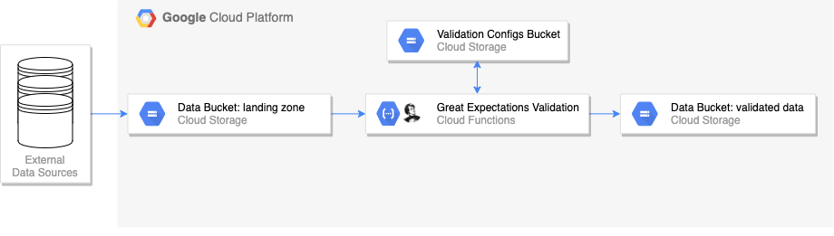

# Event Driven Testing on Google Cloud with Great Expectations

> See accompanying [blog post](https://engineeringfordatascience.com/posts/event_driven_data_validation_with_google_cloud_functions_and_great_expectations/) for a more detailed description



## Directory Structure

```
├── cloud_functions                <- directory for storing cloud functions
│   └── data_validation            <- data validation cloud function
│       ├── env.yaml               <- cloud function environment variables
│       ├── main.py                <- cloud function entry point
│       ├── requirements.txt       <- requirements for cloud function
│       └── src
│           └── gcs.py             <- utility functions for interacting with Cloud Storage
├── data                           <- directory for storing the example dataset
├── data_generator                 <- scripts for creating demo datasets
├── great_expectations
│   ├── expectations               <- data expectations definitions
│   │   └── properties.json
│   ├── great_expectations.yml     <- Great Expectations config
│   ├── loading_args               <- configurations to specify arguments for loading data into Great Expectations dataframe
│   │   └── properties.yml
│   └── uncommitted
│       └── edit_properties.ipynb  <- example notebook for defining data expectations
├── requirements.txt
└── scripts                        <- bash scripts for deploying cloud function and moving configs to GCS

```


## Getting Started

**Local Environment**

Set the following environment variables:
```bash
PROJECT=<your-GCP-project>
BUCKET=<your-gcs-bucket-name-for-storing-data>
VALIDATION_BUCKET=<your-gcs-bucket-name-for-storing-validation-configs>
```

> Include the gs:// prefix in the bucket names


Create a virtual Python environment using the top level requirements.txt file. For example:
```
# using pyenv
pyenv virtualenv 3.9.5 data_validation_cloud_functions
pyenv activate data_validation_cloud_functions

# install dev requirements
pip install -r requirements.txt
```

**GCP Infrastructure**

Ensure you have installed the [gcloud sdk](https://cloud.google.com/sdk/docs/install) and [authenticated your terminal session](https://www.the-swamp.info/blog/configuring-gcloud-multiple-projects/).

The architecture uses serverless products so there is very little overhead setting up the project resources.

All that is required is the creation of two buckets in Google Cloud Storage: one for storing the data ('data' bucket) and one for storing the Great Expectations configuration files and artifacts ('validation' bucket).

These can be created manually in the GCP console UI or using the `scripts/create_resources.sh` script.

```shell
bash scripts/create_resources.sh
```

**Copy configuration files to the validation bucket**

Before deploying the Cloud Function you need to move the Great Expectations configurations files to the validation bucket.

This can be achieved using the `scripts/move_configs_to_gcs.sh` script.

```shell
bash scripts/move_configs_to_gcs.sh
```

**Deploying the Cloud Function**

Add an `env.yaml` file to the `cloud_functions/data_validation` directory. These values will be passed to the Cloud Function as environment variables:

```yaml
PROJECT: <your-GCP-project>
BUCKET: <your-gcs-bucket-name-for-storing-data>
VALIDATION_BUCKET: <your-gcs-bucket-name-for-storing-validation-configs>
```

Deploy the Cloud Function using the `scripts/deploy_validation_function.sh` script.

```shell
bash scripts/deploy_validation_function.sh
```

**Triggering the Cloud Function**

The Cloud Function will automatically trigger when a new file is uploaded to a folder called 'landing_zone' in the 'data' bucket (env var $BUCKET).

To simulate this we can move the example datasets from the `data` directory on our local computer to the 'data' bucket in GCS using the `scripts/upload_data_to_gcs.sh`

```shell
bash scripts/upload_data_to_gcs.sh
```

**Viewing the Data Docs UI**

To view the validation results in the Great Expectations data docs UI locally, you can use the `scripts/render_data_docs.sh` script to clone the contents of the 'validation' bucket to your local computer into a directory called 'data_docs' (not under version control).

This will automatically open the UI in your browser.

```bash
scripts/render_data_docs.sh
```

---

## Data Generation [Optional]

A fake 'properties' dataset was created for the purposes of testing the data validation cloud function.

The example datasets are stored in the `data` directory.

If you are interested in generating a new dataset you can use the script in the `data_generator/data_generator.py` file. The different property types and their specific attributes are defined in the `data_generator/properties.py`. You can amend this file to change the property values created by the data generator.

To generate a fake dataset can be created by running the `data_generator.py` script from the `data_generator` module. For example:
```
cd data_generator
python data_generator.py
```

This script produces two datasets, a 'good' dataset (`data/properties/properties.csv`) and a 'bad' dataset (`data/properties_bad/properties_bad.csv`)

Once the fake dataset has been generated you can copy the `csv` file into your Google Cloud Storage bucket to trigger the cloud function (if the cloud function has been deployed) using the `scripts/upload_data_to_gcs.sh`
