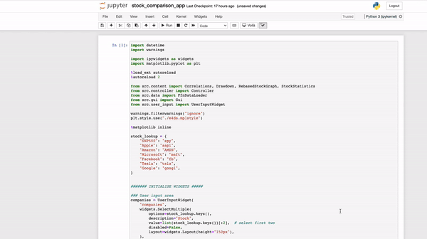

# Voila Webapp Series

This folder contains the source code for the Voila Webapp Series:
- [Part 1: Voilà! Interactive Python Dashboards Straight from your Jupyter Notebook](https://engineeringfordatascience.com/posts/voila_python_dashboard_part1/)
- [Part 2: Voilà! Optimising Python Dashboard Performance](https://engineeringfordatascience.com/posts/voila_python_dashboard_part2/)
- [Part 3: Voilà! Deploy your Jupyter notebook application on Heroku](https://engineeringfordatascience.com/posts/voila_python_dashboard_part3/)

> View the Voilà application deployed on Heroku [here](http://stock-comparison-app156.herokuapp.com/)



## Getting Started

**Docker (recommended)**

If you are familiar with Docker you can use the `docker-compose` files to build the environment.

- Run the original app without optimisation (available at localhost:8866)
  ```
  docker-compose -f part1.docker-compose.yml up --build
  ```
- Run the app using xeus-python kernel (available at localhost:8867)
  ```
  docker-compose -f part2.xeus.docker-compose.yml up --build
  ```
- Run the app using hotpooling and xeus-python kernel (available at localhost:8888)
  ```
  docker-compose -f part2.hotpooling.docker-compose.yml up --build
  ```


**Virtual Environments**

Alternatively, you can install the required packages within a virtual environment. For example, if you use `conda`:

> Note: you must be running Python 3.9 or higher

```
# create environment
conda create -n voila python=3.9 -y

# activate environment
conda activate voila

# install packages
pip install -r requirements.txt

# install xeus-python from conda forge
conda install -c conda-forge xeus-python==0.13.3
```


```
# run the original voila application
voila stock_comparison_app.ipynb


# run the optimised application with hotpooling enabled and xeus-python kernel
voila stock_comparison_app_xeus.ipynb \
    --preheat_kernel=True \
    --pool_size=5 \
    --fill_delay=1 \
    --MappingKernelManager.cull_interval=20 \
    --MappingKernelManager.cull_idle_timeout=20
```
