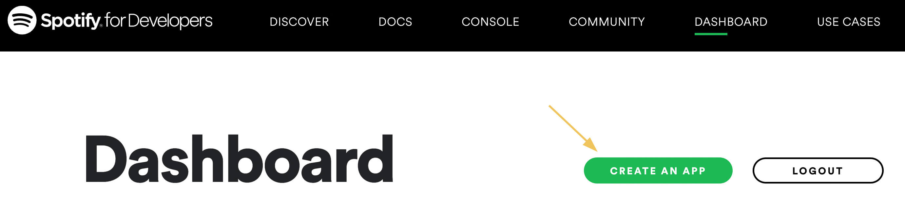
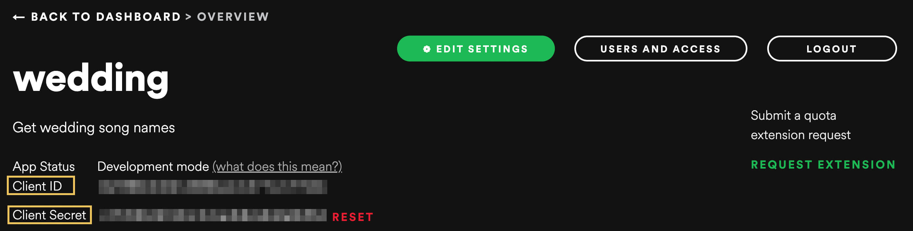
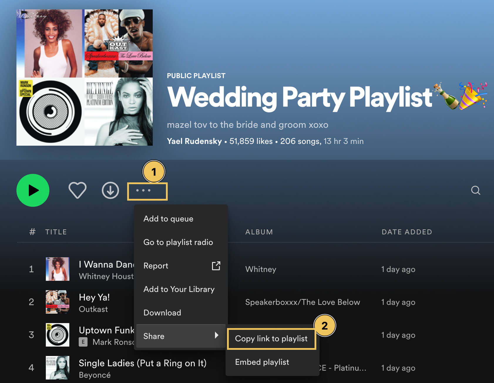

# Extracting Names and Artists from Spotify Playlist to CSV File

I love using Python 🐍 to automate boring tasks.

I recently got married 🥳 and had to provide a list of songs to the DJ. My wife and I love cheesy songs and put together a *long*  playlist on Spotify with our favourite dancing tunes.

Unfortunately, it is not possible to export the track names and artists in a nice format in the Spotify UI.

This meant I would have to manually type out the track names and artist names. As a data engineer, of course that won't do. Why spend 15 minutes doing a boring manual task, when you can spend 30 minutes automating it (and another hour writing a blog post about it)!

Luckily, with some basic Python skills you can automate and extract playlist information using the [Spotify API](https://developer.spotify.com/documentation/web-api/) and [Python library](https://spotipy.readthedocs.io/en/2.19.0/#)!

In this post, we create a simple script to use the Spotify API to extract the song titles and artists from a Spotify playlist to a csv file.

## Getting Started

### Create virtual environment

Use your favourite virtual environment manager to create a virtual environment and install the required packages in the `requirements.txt` file.

For example, running the following commands in your terminal:

```bash
# using pyenv-virtualenv
pyenv virtualenv 3.10.0 spotify
pyenv activate spotify
pip install -r requirements.txt
```

### Create a Spotify account (if you do not already have one)

Navigate to the [Spotify developer portal](https://developer.spotify.com/dashboard) and login.

### Create a new app

Register a new app in the developer console to generate your API keys.



### Get your credentials

In order to authenticate your Python application with the Spotify API you need to get your authentication keys -- `client_id` and `client_secret`.



### Create `.env` file to store Spotify API credentials

You should not store credentials directly in your scripts or in version control.

Create a new file called `.env` in this directory (not under version control) and place your client id and secret. For example:

```
# .env example
CLIENT_ID='your_client_id'
CLIENT_SECRET='your_client_secret'
```
These credentials will be loaded into the script at runtime using the [dotenv library](https://pypi.org/project/python-dotenv/).

### Find playlist link

As the input to the program, we need to get the link to the playlist. This can be found in the Spotify UI:



For example: `https://open.spotify.com/playlist/6jAarBZaMmBLnSIeltPzkz?si=d42be5c6ec194bb9`

### Run script

In the `main.py`, replace the `PLAYLIST_LINK` with the link to your target playlist, and then run the script.

```bash
python main.py
```

Your playlist track names and artist information will be available in the `data/track_info.csv` file.

## Extensions

This very simple script extracts only the track name and artists. The Spotify API is extremely data rich and contains a lot more information. I recommend looking through the [API docs](https://developer.spotify.com/documentation/web-api/) and [Python library docs](https://spotipy.readthedocs.io/en/2.19.0/) to find out what information you can extract.
